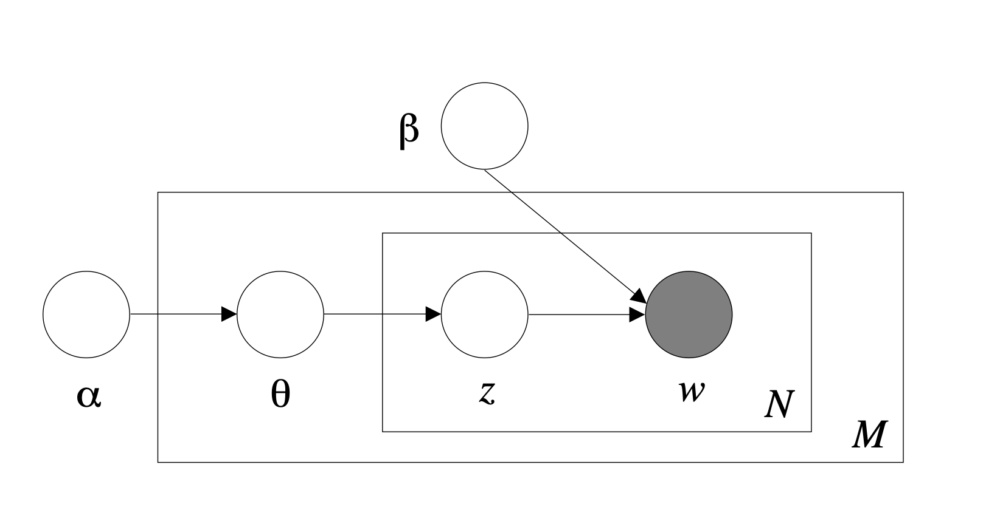

```{r global_options, include=FALSE}
knitr::opts_chunk$set(error=FALSE,        # Keep compiling upon error
                      collapse=FALSE,    # collapse by default
                      echo=TRUE,         # echo code by default
                      fig.width = 10,     # set figure width
                      fig.align = "center",# set figure position
                      out.width = "100%", # set width of displayed images
                      warning=FALSE,      # show R warnings
                      message=FALSE)      # show R messages
options(dplyr.summarise.inform = FALSE)  # ignore message about group structure
```

# Preliminaries

## Required R Packages

We will be using the following R packages: 

```{r, tidy = TRUE}
library(tidyverse)
library(tidytext)
library(gutenbergr)
library(dplyr)
library(igraph)
library(ggraph)
library(topicmodels)
library(ldatuning)
library(ggpubr)
library(topicmodels)

data(stop_words)
```

# Text Mining Motivation

The amount of data that we produce every day is truly astonishing. With the evolution of communication through social media, we generate tons and tons of data. Out of all of this generated data, only around $20\%$ are Structured and well formatted. The remaining of the data is Unstructured Data For instance, the bulk of emails we send, the text messages and the comments in social media are examples of Unstructured Data.
These Unstructured data may be analyzed and mined in order to extract useful information. 

Text Mining is the process of extracting meaningful information from unstructured natural language text data. 

A few examples of how we use text mining every day:

* Auto-complete feature
* Spam Detection
* Predictive Typing
* Spell Checker

##  Terminology

**Token:** a meaningful unit of text, such as wa word, that we are interested in using for analysis, and tokenization is the process of splitting test into tokens" [1]. Can be a word, n-gram, sentence or paragraph.

**Tokenization:** the process of splitting the whole data (corpus) into smaller chunks is known as tokenization. (i.e. sentences into words)

**Stop Words:** words that are very commonly used such as "although", "really", "from", etc. By removing such words in a language, we can focus on the important words instead.

**Document Term Matrix (DTM):** A matrix containing the terms that appear in a collection of documents and the frequency of the terms, where rows represent the documents and columns represent the words (terms). 


# Extracting Important Words: TF-IDF

**How do we determine which words are the most important in a document?**

* TF term is short for *term frequency* which indicates how frequently a word appears in a document. The document would most likely include unimportant words which we classified earlier as *stop words*, but removing the stop words would not be an efficient approach in this case because some of these words might be more important in some documents than others. 

* IDF term or *inverse document frequency* defined as :$idf(term) = ln(\frac{n_{documenta}}{n_{documents\ containing\ term}})$. This method adjust the weights and balances the usage of words in documents. This implies that it decreases the weight for widely used words and increases the weight for words that did not appear a lot.

* TF-IDF, which is short for *term frequency–inverse document frequency*, is a statistical measure that indicates how important a word is to a document in a collection. This is obtained by multiplying the 2 mentioned quantities, which would indicate "the frequency of a term adjusted for how rarely it is used".

## Example: Charles Dickens

### Top 10 words with highest tf-idf values in Charles Dicken's: 

"A Tale of Two Cities”, “Great Expectations”, “A Christmas Carol in Prose; Being a Ghost Story of Christmas”, “Oliver Twist”, "David Copperfield" and “Hard Times”.

```{r, message = FALSE, fig.align = 'center'}
## The Gutenberg IDs of the books we will be using are: 98, 1400, 46, 730, 766, 786 
dickens_books <- gutenberg_download(c(98, 1400, 46, 730, 766, 786), meta_fields = "title")

## Tokenizing all the words in the 6 books
tidy_dickens <- dickens_books %>%
  unnest_tokens(word, text)

## Visualization of the 10 words with the highest TF-IDF in each book
tidy_dickens %>%
   count(title, word, sort = TRUE) %>%
   bind_tf_idf(word, title, n) %>%
   arrange(-tf_idf) %>%
   group_by(title) %>%
   top_n(10) %>%
   ungroup %>%
   mutate(word = reorder(word, tf_idf)) %>%
   ggplot(aes(word, tf_idf, fill = title)) +
   geom_col(show.legend = FALSE) +
   facet_wrap(~ title, scales = "free") +
   coord_flip() +
   labs(y = "TF-IDF", 
        x = "Word", 
        title = "Ten Words with Highest TF-IDF in Each Book", 
        subtitle = "Before Removing Stop Words") +
   theme(plot.title = element_text(hjust = 0.5),
         plot.subtitle = element_text(hjust = 0.5))
```

As shown below, the $tf$-$idf$ values are not different after we remove the stop words because the $idf$ values of our stop words are very small, as they appear in all books. It is worth noting again that removing these stop words might not be the most efficient way because some of these words might be more important in some documents than others.  

### After removing Stop words

```{r, message = FALSE, fig.align = 'center'}
## Remove stop words
tidy_dickens <- tidy_dickens %>% anti_join(stop_words, by = c("word" = "word"))

## Visualization of the 10 words with the highest TF-IDF in each book
tidy_dickens %>%
   count(title, word, sort = TRUE) %>%
   bind_tf_idf(word, title, n) %>%
   arrange(-tf_idf) %>%
   group_by(title) %>%
   top_n(10) %>%
   ungroup %>%
   mutate(word = reorder(word, tf_idf)) %>%
   ggplot(aes(word, tf_idf, fill = title)) +
   geom_col(show.legend = FALSE) +
   facet_wrap(~ title, scales = "free") +
   coord_flip()+
   labs(y = "TF-IDF", 
        x = "Word", 
        title = "Ten Words with Highest TF-IDF in Each Book", 
        subtitle = "After Removing Stop Words") +
   theme(plot.title = element_text(hjust = 0.5),
         plot.subtitle = element_text(hjust = 0.5))
```

# Sentiment Analysis

People are expressing their emotions now more than ever using the internet which provides plenty of data for researchers to use. Sentiment analysis is the process of analyzing the emotions of a given text. Some examples of sentiment analysis are analyzing tweets to analyze sentiments towards a political candidate, prioritize angry customer requests, gauge brand reputation, and ______. Depending on the aim of your analysis, you can use one of several lexicons provided by the tidytext package to analyze the sentiment of a text. Below are the four lexicons provided by the tidytext package: 

Now that we have a book to work with, how do we determine the sentiment of the words in this book? 

## Sentiment Lexicons 

Within the tidytext library there are three lexicons for use:

1. Bing - classifies words as positive or negative
   * 6783 words
   * 3 words have duplicate sentiment categories (envious, enviously, enviousness)
   * Analyze generic sentiment about a text 

2. AFINN - assigns each token a sentiment between -5 and 5
   * 2477 words 
   * Gives a sense of degree of positivity or negativity 
   * Words do not have a duplicate sentiment values

3. NRC - groups words into one of 10 different sentiment categories: {Anger, Anticipation, Disgust, Fear, Joy, Negative, Positive, Sadness, Surprise, Trust}
   * 6468 words
   * 3688 words have duplicate sentiment categories 
      * Because words can have different meanings depending on the context, words can fall into different sentiment categories so there are duplicates in the dataset
   * Evaluate emotion

4. Loughran - groups words into one of 6 different sentiment categories: {Constraining, Litigious, Negative, Positive, Superfluous, Uncertainty}
   * 3917 words
   * Primarily used for financial text
   * 227 words have duplicate sentiment categories
   
### Comparing AFINN and BING

Because words can have different meanings depending on the context, words can fall into different sentiment categories so there are duplicates in the dataset. For simplicity since this is a introduction to text mining, we will compare only AFINN and Bing because AFINN has no duplicate values and BING has a duplicate category for three words.
   
```{r}
## Sentiment lexicons
afinn <- get_sentiments('afinn')
bing <- get_sentiments('bing')
loughran <- get_sentiments('loughran')
nrc <- get_sentiments('nrc')
```

To see how AFINN and Bing compare to one another, we will assign AFINN a positive value if it is a value greater than 0, else we will assign it a negative value. They disagree on 17 words which makes up 0.01% of the data. Therefore, AFINN and Bing generally agree with each other. 

```{r, resuts = 'hide'}
## Join afinn and bing
afinn_bing <- afinn %>% inner_join(bing, by = c('word' = 'word')) %>% 
   rename('bing_sentiment' = 'sentiment') %>%
   mutate(afinn_sentiment = ifelse(value >= 0, 'positive', 'negative'),
          same = afinn_sentiment == bing_sentiment)

## How many words do they disagree on?
dim(afinn_bing %>% filter(same == FALSE))[1]                      ## count
dim(afinn_bing %>% filter(same == FALSE))[1]/dim(afinn_bing)[1]   ## percent
```
      

## Example: A Tale of Two Cities by Charles Dickens

Previously mentioned, different lexicons can be used to perform different analyses on text data. Since Bing assigns words to be either positive or negative, it can be used to determine general positivity or negativity of a text while AFINN can be used to determine the degree of positivity or negativity because it assigns each word a value between -5 and 5. 

We will use both of these lexicons to analyze the sentiment of A Tale of Two Cities by Charles Dickens. "A Tale of Two Cities is an 1859 historical novel by Charles Dickens, set in London and Paris before and during the French Revolution. The novel tells the story of the French Doctor Manette, his 18-year-long imprisonment in the Bastille in Paris and his release to live in London with his daughter Lucie, whom he had never met. The story is set against the conditions that led up to the French Revolution and the Reign of Terror." (Wikipedia).

The book begins with 137,388 but 91,188 stop words are removed leaving 46,200 words for analysis.

```{r, results = 'hide'}
## We will be working with A Tale of Two Cities, which has id 98
two_cities <- gutenberg_download(98)

## There are three books that make up this book
## Get book number
two_cities <- two_cities %>% mutate(book = cumsum(str_detect(text, regex("^Book the"))),
                                    linenumber = row_number())

## For each book get the linenumber in the book, and the chapter
## Roman numerals: https://www.oreilly.com/library/view/regular-expressions-cookbook/9780596802837/ch06s09.html
two_cities <- two_cities %>% group_by(book) %>% 
   mutate(book_linenumber = row_number(),
          chapter = cumsum(str_detect(text, regex("^(?=[MDCLXVI])M*(C[MD]|D?C{0,3})(X[CL]|L?X{0,3})(I[XV]|V?I{0,3})[.]")))) %>%
   ungroup()

## Convert to tidy text
two_cities <- two_cities %>% unnest_tokens(word, text)

## Remove stop words
## Solution to error: https://stackoverflow.com/questions/9221310/r-debugging-only-0s-may-be-mixed-with-negative-subscripts
tidy_two_cities <- two_cities %>% anti_join(stop_words, by = c("word" = "word"))

## How many words were removed?
dim(two_cities)[1]
dim(two_cities)[1] - dim(tidy_two_cities)[1]
dim(tidy_two_cities)[1]
```

### Overall sentiment of A Tale of Two Cities

We will begin by examining the overall sentiment of A Tale of Two Cities, we will do this by considering the sentiment all of the words excluding stop words. 

**Bing** 

Using the Bing sentiment lexicon, we can calculate the sentiment by looking at the number of positive words minus the number of negative words in the document to determine sentiment. If the associated value is greater than 0, this indicates that the text is generally positive. If the associated value is negative, this indicates that the text is generally negative. Finally, if the associated value is equal to 0, this means that the text is neutral. When we join the bing sentiment lexicon with our data from A Tale of Two Cities, there are only 7790 words in the book that have an associated bing sentiment category, which represents only 16% of the words after we remove stop words. 

$$Sentiment(text) = # positive words - # negative words$$

$$Sentiment(A\ Tale\ of\ Two\ Cities) = 2852 - 4938 = -2086$$

Since the associated sentiment is less than 0, this indicates that A Tale of Two Cities is generally negative. 

```{r, results = 'hide'}
## Overall sentiment using Bing
## Join bing sentiment dataset with A Tale of Two Cities data
bing_two_cities <- tidy_two_cities %>% left_join(bing, by = c('word' = 'word')) %>% rename('bing' = 'sentiment')

## How many words have an associated bing sentiment?
dim(bing_two_cities %>% filter(!is.na(bing)))[1]
dim(bing_two_cities %>% filter(!is.na(bing)))[1]/dim(bing_two_cities)[1]

## Filter for words that have a bing sentiment category
bing_two_cities <- bing_two_cities %>% filter(!is.na(bing))

## Overall sentiment 
num_positive <- dim(bing_two_cities %>% filter(bing == "positive"))[1]
num_negative <- dim(bing_two_cities %>% filter(bing != "positive"))[1]
overall_sentiment <- num_positive - num_negative
```
**AFINN** 

Using the AFINN sentiment lexicon, we can calculate the sentiment by taking the mean of all of the sentiment values in the document. If the associated value is greater than 0, this indicates that the text is generally positive. If the associated value is negative, this indicates that the text is generally negative. Finally, if the associated value is equal to 0, this means that the text is neutral. A benefit of using AFINN over Bing is that it takes into consideration the magnitude of positivity or negativity of a word. Even if there were more negative words in a text, If the magnitude of positive words were greater than the magnitude of negative words, this could cause the sentiment to be positive. When we join the AFINN sentiment lexicon with our data from A Tale of Two Cities, there are only 6066 words in the book that have an associated AFINN sentiment value, which represents only 13% of the words after removing stop words. Let n be the number of words in the text that have an associated AFINN value.

$$Sentiment(text) = \frac{\sum_i AFINN_i}{n}$$

$$Sentiment(A\ Tale\ of\ Two\ Cities) = \frac{-2218}{6066} = -0.3656$$

Since the associated sentiment is less than 0, this indicates that the associated text is generally negative. However, since the value is so close to this means that there are more negative words in the book than positive words. To break this down, we can look at the number of positive words and the number of negative words and their mean AFINN values. There are 2,461 words with an AFINN value greater than 0 and a mean AFINN value of 1.913. There are 3,605 words with an AFINN value less than 0 with a mean AFINN value of -1.911. The average values for these two categories is similar, but since there are more negative words in the book, this will cause the combined sentiment to be less than 0.

```{r, results = 'hide'}
## Overall sentiment using AFINN
## Join sentiments with Tale of Two Cities
afinn_two_cities <- tidy_two_cities %>% left_join(afinn, by = c('word' = 'word')) %>% rename('afinn' = 'value')

## How many words have an associated afinn sentiment?
dim(afinn_two_cities %>% filter(!is.na(afinn)))[1]
dim(afinn_two_cities %>% filter(!is.na(afinn)))[1]/dim(afinn_two_cities)[1]

## Filter for words that have a sentiment value
afinn_two_cities <- afinn_two_cities %>% filter(!is.na(afinn))

## Overall sentiment 
mean(afinn_two_cities$afinn)
```

### Sentiment broken down by book and chapter: analyzing sentiment change over time

After analyzing the overall sentiment of A Tale of Two Cities, let's now analyze how the sentiment changes over time. We will do this by looking at the sentiment each chapter of the three books that make up A Tale of Two Cities. 

```{r, fig.align = 'center'}
## Make book a category instead of a numeric
bing_two_cities$book <- as.character(bing_two_cities$book)
afinn_two_cities$book <- as.character(afinn_two_cities$book)

## Sentiment of each book using Bing
overall_bing <- bing_two_cities %>% 
   group_by(book) %>% 
   summarize(num_pos = sum(bing == "positive"),
             num_neg = sum(bing == "negative"),
             sentiment = num_pos - num_neg) %>% 
   filter(book > 0) %>%
   ggplot() + 
   geom_bar(aes(x = book, y = sentiment, fill = book), stat = 'identity', show.legend = FALSE) + 
   xlab("Book") + 
   ylab("Bing Sentiment") +
   ggtitle("Bing Sentiment by Book") + 
   theme(plot.title = element_text(hjust = 0.5))

## Sentiment of each book using AFINN
overall_afinn <- afinn_two_cities %>% 
   group_by(book) %>% 
   summarize(average_sentiment = mean(afinn)) %>% 
   filter(book > 0) %>%
   ggplot() + 
   geom_bar(aes(x = book, y = average_sentiment, fill = book), stat = 'identity', show.legend = FALSE) + 
   xlab("Book") + 
   ylab("AFINN Sentiment") +
   ggtitle("AFINN Sentiment by Book") + 
   theme(plot.title = element_text(hjust = 0.5))

## Print these two plots side by side
## https://sebastiansauer.github.io/two-plots-rmd/
ggarrange(overall_bing, overall_afinn, ncol = 2)
```

```{r, fig.align = 'center'}
## Sentiment of each chapter using Bing
chapter_bing <- bing_two_cities %>% 
   filter(book > 0 & chapter > 0) %>% 
   group_by(book, chapter) %>% 
   arrange(book, chapter) %>% 
   summarize(combo = cur_group_id(),
             num_pos = sum(bing == "positive"),
             num_neg = sum(bing == "negative"),
             sentiment = num_pos - num_neg) %>%
   ungroup()

chapter_bing_plot <- chapter_bing %>%
   ggplot() + 
   geom_bar(aes(x = combo, y = sentiment, fill = book), stat = 'identity', show.legend = FALSE) + 
   xlab("Chapter") + 
   ylab("Bing Sentiment") +
   ggtitle("Bing Sentiment by Book and Chapter") + 
   theme(plot.title = element_text(hjust = 0.5))

## Sentiment of each chapter using AFINN
chapter_afinn <- afinn_two_cities %>% 
   filter(book > 0 & chapter > 0) %>% 
   group_by(book, chapter) %>% 
   arrange(book, chapter) %>% 
   summarize(combo = cur_group_id(),
             average_sentiment = mean(afinn)) %>%
   ungroup()

chapter_afinn_plot <- chapter_afinn %>% 
   ggplot() + 
   geom_bar(aes(x = combo, y = average_sentiment, fill = book), stat = 'identity') + 
   xlab("Chapter") + 
   ylab("AFINN Sentiment") +
   ggtitle("AFINN Sentiment by Book and Chapter") + 
   theme(plot.title = element_text(hjust = 0.5))

## Print these two plots side by side
ggarrange(chapter_bing_plot, chapter_afinn_plot, ncol = 2)
```

Disadvantages of looking at words individually is that you cannot look at how they work together to form a sentence. In English, a double negative creates a positive. 


# Sequences of Words: n-grams

It is sometimes useful to look at groups of words in order to understand how they can relate and build off one another. The n-grams of a passage are all the length $n$ sequences of words. For example, the bi-grams of "The quick brown fox jumped" are:

* the quick
* quick brown
* brown fox
* fox jumped

and the tri-grams are:

* the quick brown
* quick brown fox
* brown fox jumped

Notice that these n-grams can contain stopwords, so it is often a good idea to filter out any results that include at least one. In practice, we can mine text for all n-grams with lengths between some specified min and max, but here we start by extracting the bigrams from *A Tale of Two Cities*.

```{r}
## Download book text
two_cities <- gutenberg_download(98)['text']

## Remove blank spaces
two_cities <- two_cities[two_cities$text != '',]

## Remove header material
two_cities <- two_cities[53:nrow(two_cities), ]

## Find all size 2 n-grams
## Filter out pairs with stopwords
ngrams <- unnest_tokens(two_cities, ngram, text, token = 'ngrams', n = 2) %>%
  separate(col = ngram, into = c('first', 'second'), sep = ' ') %>%
  filter(!(first %in% stop_words$word)) %>%
  filter(!(second %in% stop_words$word))

print(paste('There are', nrow(ngrams), 'bigrams without stopwords'))
```

Even after removing the n-grams that contain stopwords, there are still nearly 12,000 results. We can count the occurrences of each unique pair in order to reduce this number and get a better idea of which bigrams are important.

```{r}
## Find the number of occurrences for each pair
## Take the top 50
ngrams <- ngrams %>%
  group_by(first, second) %>%
  summarize(n=n()) %>%
  arrange(desc(n)) %>%
  head(50) %>% 
  ungroup()

head(ngrams)
```

Since this text is from a novel, the most common pairs represent the names of characters who are frequently mentioned. Still, some other results may be interesting. We can visualize these by treating the bigrams as a directed graph.

```{r}
## Make a directed graph of bigrams
g <- graph.data.frame(ngrams, directed=T)

## Display graph
ggraph(g, layout='kk') +
  geom_edge_link(arrow=arrow(angle=20, type='closed', length=unit(0.1, 'inches')),
                 aes(color=n)) +
  geom_node_point() +
  geom_node_text(aes(label=name), size=2, vjust=1.5, hjust=1) +
  scale_edge_color_gradient(low='red', high='blue')
```

## Bigram TF-IDF

We can also calculate teh TF-IDF scores for bigrams in the works of Charles Dickens. This shows the most important pairs of words for each book.

```{r, out.width = "100%"}
dickens_books <- gutenberg_download(c(98, 1400, 46, 730, 766, 786), meta_fields = "title")
## Tokenizing all the bigrams in the 6 books
tidy_dickens <- dickens_books %>%
  unnest_tokens(ngram, text, token='ngrams', n=2)
## Visualization of the 10 bigrams with the highest TF-IDF in each book
tidy_dickens %>%
   count(title, ngram, sort = TRUE) %>%
   bind_tf_idf(ngram, title, n) %>%
   arrange(-tf_idf) %>%
   group_by(title) %>%
   top_n(10) %>%
   ungroup %>%
   mutate(ngram = reorder(ngram, tf_idf)) %>%
   ggplot(aes(ngram, tf_idf, fill = title)) +
   geom_col(show.legend = FALSE) +
   facet_wrap(~ title, scales = "free") +
   coord_flip() +
   labs(y = "TF-IDF", 
        x = "", 
        title = "Ten Bigrams with Highest TF-IDF in Each Book") +
   theme(plot.title = element_text(hjust = 0.5),
         plot.subtitle = element_text(hjust = 0.5))
```

# Topic Modeling

Topic modeling is an unsupervised method of clustering words from documents into topics. It is unsupervised because we do not know the true topics for the words, but our goal is to discover latent or hidden patterns in the collection of documents. It is similar to clustering numeric data. One example of a use case is if you were a paralegal and had a large batch of emails from discovery, you could use topic modeling to try to identify the topics people were writing about without having to read every document. 


## Latent Direchlet Allocation

One of the most popular methods for topic modeling is Latent Dirichlet Allocation. Latent Dirichlet Allocation is a probabilistic generative model where each document is a collection of topics and each topic is a collection of words [5]. For example, a document could be comprised of 60% of one topic and 40% of another topic. By looking at the collection of words in a topic, you could infer the meaning. If the first topic was made of 40% of the word apple, 25% of the word orange, etc. the topic could be fruit. Below is a graphical model of LDA:




$\alpha$ is a hyperparameter on the Dirichlet distribution of $\theta$, and $theta$ is the probabilities of topics in documents.

$\beta$ is a hyperparameter on the Dirichlet distribution of words in a particular document.

$M$ represents the number of topics and $N$ represents the number of words.

$z$ are the topics and $w$ are the words. $w$ is shaded because it is a known variable.

For the LDA model, first you choose the values of your hyperparameters and, $M$, the number of topics. For each of the $N$ words, we want to choose a topic $z_n$ from the multinomial ($\Theta$) distribution, which represents the distribution of topics in each document. Then we want to choose a word $w_n$ from the conditional probability $p(w_n|z_n,\ebta)$ which is the probability of the word given the document. After going through each word and assigning the proportion of words to topics and topics to documents, we repeat this process a specified number of times. 

## Example: Clustering Books by Author

To show how LDA can work in practice, let's consider an example. Say you have 20 book titles from the top 10 authors from the Project Gutenberg and want to know how many distinct authors wrote the set of books and which books were written by the same author. We can use topic modeling to cluster the books into topics which presumably represent the authors of the books.

### Obtaining and Preparing the Texts

First we'll create an array of the popular author names and then obtain all books by these authors from Project Gutenberg. We will limit our selection to works written in English and ignore collections and parts of works.

```{r}
## Set of popular authors
authors.popular <-
   c(
      "Dickens, Charles",
      "Austen, Jane",
      "Shelley, Mary Wollstonecraft",
      "Twain, Mark",
      "Doyle, Arthur Conan",
      "Wilde, Oscar",
      "Leech, John",
      "Hawthorne, Nathaniel",
      "Stevenson, Robert Louis",
      "Carroll, Lewis"
   )
```


Then we will get all books by these authors from Project Gutenberg. We will limit our selection to works written in English and ignore collection of works.

```{r}
## Create list of words that appear in titles to remove parts of books, collections, and letters of the author
ignore.strings <- c("Works", "Part", "Volume", "Chapters", "From \"", "From:")

## Get books from the popular authors listed above
books.authors.popular <- gutenberg_metadata %>%
   filter(
      author %in% authors.popular,
      language == "en", # Only English works
      !str_detect(title, paste(ignore.strings, collapse = "|")),
      has_text,
      !str_detect(rights, "Copyright") # Ignore copyrighted works
   ) %>%
   distinct(title, .keep_all = TRUE) %>% # Remove duplicate titles
   select(gutenberg_id, title, author)
```

Next, select a random sample of 20 books and download them.

```{r}
## Sample 20 books from the books from populaor authos
set.seed(905)
books.selection <- books.authors.popular %>% sample_n(20)

## Download the 20 books
books.list <-
   books.selection$gutenberg_id %>% gutenberg_download(meta_fields = "title")
```

Now we have the text of all 20 books in a data frame. We will need to remove blank rows of the text and use the unnest_tokens function from the tidytext package to split our columns of text into one word per row for each document.

```{r}
## Clean the data from the selected books
books.text <- books.list %>%
   filter(text != '') %>% # Remove blank lines
   select(-gutenberg_id) %>% # Drop the id
   group_by(title)  %>%
   unite(document, title)

## Perform tokenization
words.by.book <- books.text %>%
   unnest_tokens(word, text)
```

Next we will calculate how many times each word appears in each document so we can turn our data into a Document Term Matrix to run the LDA model. We will also remove stop words. 

```{r, message = FALSE}
## Remove stop words, numbers, and text that begins with an underscores
## Then get the frequency of each of these words
word.counts <- words.by.book %>%
   anti_join(stop_words) %>% # Remove stop words
   filter(
   !str_detect(word, "[0-9]"), # Remove words that are numbers
   !str_detect(word, "^_"), # Remove text that starts with an underscore
   ) %>%
   count(document, word, sort = TRUE) %>%
   ungroup()

## Create a Document Term Matrix
books.dtm <- word.counts %>%
   cast_dtm(document, word, n)
```

### LDA Model

To run the LDA model from the topicmodels package, we will also have to select a k for the number of topics (authors). Let's try 5.

```{r}
## Run an LDA model
books.lda <- LDA(books.dtm, k = 5, control = list(seed = 600))
```

First, we can look at the probabilities of each word belonging to each topic. After convert the LDA results to a tidy data frame, there will be a row for each topic and term and its probability. Let's convert this into showing the 7 most likely words in each topic and graph it.

```{r}
books.topics <- tidy(books.lda, matrix = "beta")
words.top <- books.topics %>% 
   group_by(topic) %>%
   top_n(7, beta) %>%
   ungroup() %>%
   mutate(term = reorder_within(term, beta, topic))

ggplot(words.top, aes(beta, term, fill = factor(topic))) +
 geom_col(show.legend = FALSE) +
 facet_wrap(~ topic, scales = "free") +
 scale_y_reordered()

```

Let's look at some uncommon words or names in topic 1 such as "dombey" and "florence".

```{r}
word.counts %>% filter(word == "dombey")

word.counts %>% filter(word=="florence")
```

"domebey" and "florence" both appear most often from "Dombey and Son" so it is a good sign that words from the same document are grouped in the same topic. We don't know how many authors we have so ideally we can run this LDA model for every possible number of topics, 1 to 10, and use an evaluation metric to determine which is the best "fit" for the different clusters. We can use the ldatuning package to do this for us. The package provides a metric called "Arun2010" that we will use to determine which k to use for our model. We want to select k that is the smallest as this metric measures the K-L divergence and this value is higher for non-optimal values of k [8].

```{r}
topics.results <- FindTopicsNumber(
      books.dtm,
      control=list(seed = 455),
      topics = seq(1,10),
      metrics = "Arun2010",
      method = "Gibbs",
)

# Print results
topics.results %>% arrange(Arun2010)

```

### Results

The k will the lowest Arun2010 score is 8 from so we will run our LDA model again with k=8 and look at the top word probabilities and see how they have changed.

```{r}
books.lda.optimal <- LDA(books.dtm, k = 8, control = list(seed = 555))

books.topics.optimal <- tidy(books.lda.optimal, matrix = "beta")
words.top.optimal <- books.topics.optimal %>% 
   group_by(topic) %>%
   top_n(7, beta) %>%
   ungroup() %>%
   mutate(term = reorder_within(term, beta, topic))

ggplot(words.top.optimal, aes(beta, term, fill = factor(topic))) +
  geom_col(show.legend = FALSE) +
 facet_wrap(~ topic, scales = "free") +
 scale_y_reordered()

```

We can also look at the composition of topics in each document by extracting the gamma values from our LDA model. The gamma values represent the mixtures of topics for each document. Since each book (document) is written by a different author (topic), we expect that each document should be made up of only one topic. This holds true for almost all the books and every book has 1 dominant topic.

```{r}
books.docs.optimal <- tidy(books.lda.optimal, matrix = "gamma")

books.docs.optimal %>% 
   group_by(document) %>%  # Group by each book
   ggplot(aes(x=str_trunc(document, 30), y=gamma, fill=factor(topic))) +
   geom_bar(stat='identity') + coord_flip() +
   labs(title="Composition of Topics in Documents", x="document", fill = "topic")

```

Let's compare the number of unique authors in our 20 books to the k we selected. Also we will examine the authors in each topic to see how LDA groups them. 

```{r}
as.numeric(books.selection %>% distinct(author) %>% count())

books.docs.optimal %>% 
   group_by(document) %>%  # Group by each book
   top_n(n=1) %>% # Select the max gamma for each book
   rename("title"="document")  %>% # rename document to title to join on the authors
   left_join(books.selection) %>%
   group_by(topic) %>%
   summarise(authors = paste(author, collapse="; ")) # Combine the authors for each topic into one row

```


We did select the same number of topics as authors in our book set, but our LDA model did not quite put the distinct authors into each topic. Some topics contained multiples of the same author such as the second topic contains 2 books by Robert Stevenson, but it contains a third book by Arthur Doyle. Topics 5 and 6 only have one book and they are written by by Charles Dickens. The model may not have enough examples for each author to distinguish between them as we only used 20 books. Even though we used the same number of topics as authors, LDA finds latent patterns in text, which can be different than what we expect. One way to try to identify the meaning of the topics is to examine common and rare words and identify similarities between them and consider their source.

# References

1. [Text Mining with R](https://www.tidytextmining.com/index.html)

2. [Project Gutenberg](https://www.gutenberg.org/)

3. [Roman Numerals with Regex](https://www.oreilly.com/library/view/regular-expressions-cookbook/9780596802837/ch06s09.html)

4. [Sentiment Datasets](https://www.datacamp.com/community/tutorials/sentiment-analysis-R)

5. [Latent Dirichlet Allocation](http://www.cse.cuhk.edu.hk/irwin.king/_media/presentations/latent_dirichlet_allocation.pdf)

6. [TF-IDF](https://cran.r-project.org/web/packages/tidytext/vignettes/tf_idf.html) 

7. [Loughran Sentiment Dataset](https://www.rdocumentation.org/packages/tidytext/versions/0.2.0/topics/sentiments)

8. [On Finding the Natural Number of Topics with Latent Dirichlet Allocation](https://doi.org/10.1007/978-3-642-13657-3_43)

9. [Sentiment Analysis](https://monkeylearn.com/sentiment-analysis/)

10. [A Tale of Two Cities Summary](https://en.wikipedia.org/wiki/A_Tale_of_Two_Cities)
